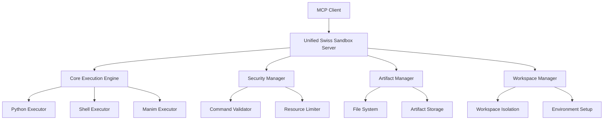

# Design Document

## Overview

The Swiss Sandbox system restoration involves consolidating multiple fragmented server implementations into a single, unified, and reliable MCP server. The current system has been corrupted with broken redirects, hanging execute tools, scattered functionality across multiple modules, and overly restrictive security systems.

The restoration will create a clean, maintainable architecture that preserves all existing functionality while eliminating the chaos introduced by the incompetent agent.

## Architecture

### High-Level Architecture



### Server Consolidation Strategy

The design consolidates the following scattered components:
- `src/sandbox/mcp_sandbox_server.py` (currently broken redirect)
- `src/sandbox/ultimate/server.py` (fragmented ultimate server)
- `src/sandbox/intelligent_sandbox_server.py` (intelligent features)
- `src/sandbox/mcp_sandbox_server_stdio.py` (stdio transport)

Into a single authoritative server: `src/sandbox/unified_server.py`
## Compone
nts and Interfaces

### 1. Unified MCP Server (`UnifiedSandboxServer`)

**Responsibilities:**
- Single entry point for all MCP operations
- Tool registration and management
- Request routing and response handling
- Error handling and logging

**Interface:**
```python
class UnifiedSandboxServer:
    def __init__(self, config: ServerConfig)
    def register_tools(self) -> None
    def start(self, transport: str = 'stdio') -> None
    def handle_request(self, request: MCPRequest) -> MCPResponse
```

### 2. Core Execution Engine (`ExecutionEngine`)

**Responsibilities:**
- Execute Python code, shell commands, and specialized tools
- Manage execution context and environment
- Handle timeouts and resource limits
- Provide execution history and debugging

**Interface:**
```python
class ExecutionEngine:
    def execute_python(self, code: str, context: ExecutionContext) -> ExecutionResult
    def execute_shell(self, command: str, context: ExecutionContext) -> ExecutionResult
    def execute_manim(self, script: str, context: ExecutionContext) -> ExecutionResult
    def get_execution_history(self) -> List[ExecutionRecord]
```

### 3. Security Manager (`SecurityManager`)

**Responsibilities:**
- Validate commands and code before execution
- Apply security policies and restrictions
- Manage resource limits and sandboxing
- Balance security with usability

**Interface:**
```python
class SecurityManager:
    def validate_command(self, command: str) -> ValidationResult
    def validate_python_code(self, code: str) -> ValidationResult
    def apply_resource_limits(self, context: ExecutionContext) -> None
    def is_safe_operation(self, operation: str) -> bool
```### 
4. Artifact Manager (`ArtifactManager`)

**Responsibilities:**
- Manage generated files and outputs
- Handle artifact storage and retrieval
- Track artifact metadata and versions
- Provide artifact cleanup and maintenance

**Interface:**
```python
class ArtifactManager:
    def store_artifact(self, content: bytes, metadata: ArtifactMetadata) -> str
    def retrieve_artifact(self, artifact_id: str) -> Artifact
    def list_artifacts(self, filter_criteria: Dict) -> List[ArtifactInfo]
    def cleanup_artifacts(self, retention_policy: RetentionPolicy) -> None
```

### 5. Workspace Manager (`WorkspaceManager`)

**Responsibilities:**
- Manage isolated execution environments
- Handle workspace creation and cleanup
- Provide environment variable management
- Support virtual environment integration

**Interface:**
```python
class WorkspaceManager:
    def create_workspace(self, config: WorkspaceConfig) -> Workspace
    def get_workspace(self, workspace_id: str) -> Workspace
    def cleanup_workspace(self, workspace_id: str) -> None
    def setup_environment(self, workspace: Workspace) -> None
```

## Data Models

### ExecutionContext
```python
@dataclass
class ExecutionContext:
    workspace_id: str
    user_id: Optional[str]
    environment_vars: Dict[str, str]
    resource_limits: ResourceLimits
    security_level: SecurityLevel
    artifacts_dir: Path
    execution_globals: Dict[str, Any]
```

### ExecutionResult
```python
@dataclass
class ExecutionResult:
    success: bool
    output: str
    error: Optional[str]
    execution_time: float
    artifacts: List[str]
    metadata: Dict[str, Any]
```

### ServerConfig
```python
@dataclass
class ServerConfig:
    max_execution_time: int = 30
    max_memory_mb: int = 512
    security_level: SecurityLevel = SecurityLevel.MODERATE
    artifacts_retention_days: int = 7
    enable_manim: bool = True
    enable_web_apps: bool = True
```## 
Error Handling

### Error Categories
1. **Execution Errors**: Code/command execution failures
2. **Security Errors**: Blocked operations due to security policies
3. **Resource Errors**: Memory, time, or disk space limitations
4. **System Errors**: Server internal errors and failures

### Error Response Strategy
- Provide clear, actionable error messages
- Include suggestions for resolution when possible
- Log detailed error information for debugging
- Maintain system stability despite individual operation failures

### Timeout and Hanging Prevention
- Implement execution timeouts with configurable limits
- Use process monitoring to detect and terminate hanging operations
- Provide progress indicators for long-running operations
- Allow graceful cancellation of operations

## Testing Strategy

### Unit Testing
- Test individual components in isolation
- Mock external dependencies and file system operations
- Verify error handling and edge cases
- Test security validation logic

### Integration Testing
- Test complete execution workflows
- Verify MCP protocol compliance
- Test artifact management and cleanup
- Validate workspace isolation

### Performance Testing
- Test execution timeout handling
- Verify resource limit enforcement
- Test concurrent operation handling
- Measure memory usage and cleanup

### Security Testing
- Test command injection prevention
- Verify file system access restrictions
- Test resource exhaustion protection
- Validate privilege escalation prevention