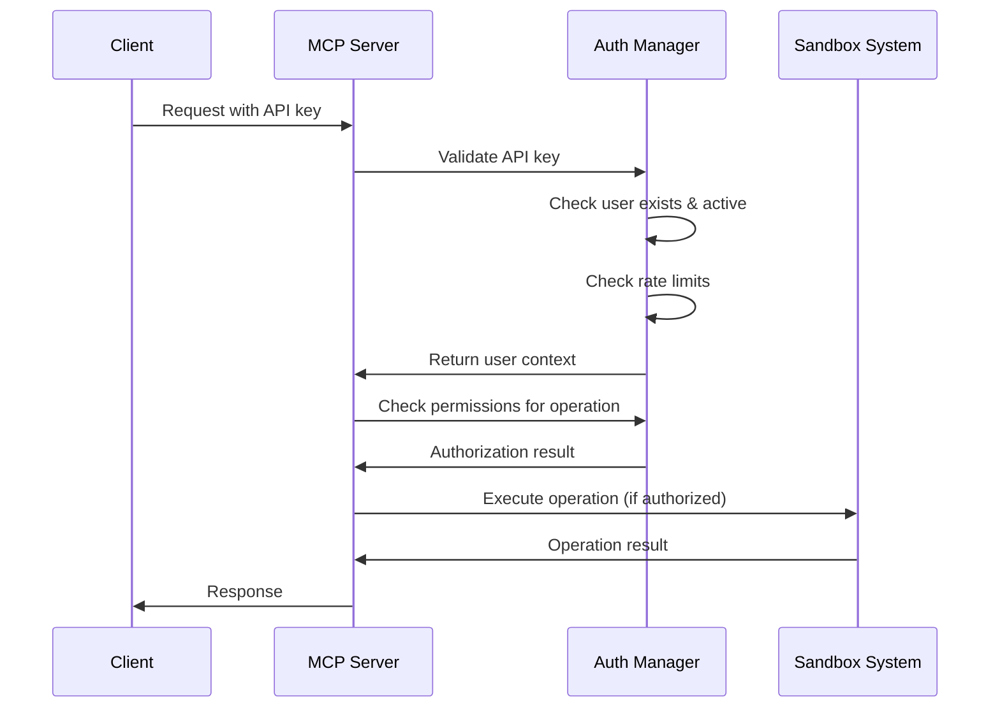

# Authentication and Authorization System Explanation

## Overview

The Intelligent Sandbox System implements a comprehensive **API key-based authentication system** with **role-based access control (RBAC)** to secure all sandbox operations. This system ensures that only authorized users can access sandbox functionality and that they can only perform operations they have permission for.

## 🔑 Authentication System Components

### 1. API Key Authentication

**How it works:**
- Each user is assigned a unique API key in the format: `sb_[32-character-hex]`
- API keys are required for ALL sandbox operations
- Keys are validated on every request to the MCP server

**Example API Key:** `sb_a1b2c3d4e5f6789012345678901234567890abcd`

### 2. User Management

**User Structure:**
```json
{
  "id": "unique-user-id",
  "username": "developer1",
  "api_key": "sb_a1b2c3d4e5f6789012345678901234567890abcd",
  "role": "developer",
  "permissions": ["create_workspace", "analyze_codebase", "execute_task_plan"],
  "active": true,
  "rate_limit": 100
}
```

**User Roles:**
- **ADMIN**: Full access to all operations including user management
- **DEVELOPER**: Can create workspaces, analyze code, plan and execute tasks
- **VIEWER**: Read-only access to view status and history

### 3. Permission System

**Available Permissions:**
- `CREATE_WORKSPACE`: Create new sandbox workspaces
- `DELETE_WORKSPACE`: Delete/cleanup workspaces
- `ANALYZE_CODEBASE`: Analyze project structure and dependencies
- `CREATE_TASK_PLAN`: Generate task plans from descriptions
- `EXECUTE_TASK_PLAN`: Execute planned tasks in sandbox
- `VIEW_HISTORY`: View execution history and logs
- `VIEW_STATUS`: View system and workspace status
- `MANAGE_USERS`: Manage user accounts and permissions

## 🛡️ How Authentication Works in Practice

### 1. MCP Tool Calls

When you use any MCP tool, you must provide your API key:

```python
# Example: Creating a workspace
result = mcp_server.create_sandbox_workspace({
    'source_path': '/path/to/project',
    'api_key': 'sb_your_api_key_here'  # ← Required for authentication
})
```

### 2. Request Flow



### 3. Authentication Configuration

The system uses a `sandbox_auth.json` file to store user credentials:

```json
{
  "users": [
    {
      "id": "admin-user-id",
      "username": "admin",
      "api_key": "sb_admin_key_here",
      "role": "admin",
      "permissions": ["all"],
      "created_at": 1691234567.0,
      "last_access": 1691234567.0,
      "active": true,
      "rate_limit": 1000
    },
    {
      "id": "dev-user-id", 
      "username": "developer1",
      "api_key": "sb_dev_key_here",
      "role": "developer",
      "permissions": [
        "create_workspace",
        "analyze_codebase", 
        "create_task_plan",
        "execute_task_plan",
        "view_history",
        "view_status"
      ],
      "active": true,
      "rate_limit": 100
    }
  ]
}
```

## 🔒 Security Features

### 1. Rate Limiting
- Each user has a configurable rate limit (requests per hour)
- Prevents abuse and ensures fair resource usage
- Default: 100 requests/hour for developers, 1000 for admins

### 2. Session Management
- Temporary sessions created for authenticated requests
- Sessions expire after 1 hour of inactivity
- Automatic cleanup of expired sessions

### 3. Request Validation
- All requests validated for proper API key format
- User account status checked (active/inactive)
- Operation permissions verified before execution

### 4. Audit Logging
- All authentication attempts logged
- Failed authentication attempts tracked
- User activity monitoring for security analysis

## 🚀 Usage Examples

### Example 1: Basic Workspace Creation

```python
from sandbox.intelligent.mcp.server import IntelligentSandboxMCPServer

server = IntelligentSandboxMCPServer()

# This will fail without API key
result = server._tool_create_sandbox_workspace({
    'source_path': '/path/to/project'
}, None)
# Result: {"success": False, "error": "Authentication failed"}

# This will succeed with valid API key
result = server._tool_create_sandbox_workspace({
    'source_path': '/path/to/project',
    'api_key': 'sb_your_valid_api_key_here'
}, None)
# Result: {"success": True, "workspace_id": "workspace-123", ...}
```

### Example 2: Permission-Based Access

```python
# Admin user can manage other users
admin_result = server._tool_manage_users({
    'action': 'create_user',
    'username': 'newdev',
    'role': 'developer',
    'api_key': 'sb_admin_api_key'
}, None)
# Result: Success

# Developer user cannot manage users
dev_result = server._tool_manage_users({
    'action': 'create_user', 
    'username': 'newdev',
    'role': 'developer',
    'api_key': 'sb_developer_api_key'
}, None)
# Result: {"success": False, "error": "Insufficient permissions"}
```

### Example 3: Rate Limiting

```python
# After 100 requests in an hour
result = server._tool_analyze_codebase({
    'workspace_id': 'workspace-123',
    'api_key': 'sb_developer_api_key'
}, None)
# Result: {"success": False, "error": "Rate limit exceeded"}
```

## 🔧 Configuration and Setup

### 1. Default Admin User

When the system starts for the first time, it automatically creates a default admin user:

```
Username: admin
API Key: [automatically generated]
Role: admin
Permissions: all
```

The API key is logged to the console on first startup.

### 2. Adding New Users

Admins can add new users through the management interface or by directly editing the `sandbox_auth.json` file:

```json
{
  "id": "new-user-id",
  "username": "newdeveloper",
  "api_key": "sb_generated_key_here",
  "role": "developer", 
  "permissions": [
    "create_workspace",
    "analyze_codebase",
    "create_task_plan",
    "execute_task_plan",
    "view_history",
    "view_status"
  ],
  "active": true,
  "rate_limit": 100
}
```

### 3. Environment Variables

You can configure authentication through environment variables:

```bash
export SANDBOX_AUTH_CONFIG="/path/to/custom/auth.json"
export SANDBOX_DEFAULT_RATE_LIMIT=200
export SANDBOX_SESSION_TIMEOUT=7200  # 2 hours
```

## 🛠️ Development and Testing

### Testing Authentication

```python
# Test authentication in development
from sandbox.intelligent.mcp.auth import AuthenticationManager

auth_manager = AuthenticationManager("test_auth.json")

# Create test user
test_user = auth_manager.create_user(
    username="testuser",
    role="developer",
    api_key="sb_test_key_123"
)

# Test authentication
user = auth_manager.authenticate("sb_test_key_123")
assert user is not None
assert user.username == "testuser"
```

### Mock Authentication for Testing

```python
# For unit tests, you can mock authentication
from unittest.mock import Mock

mock_auth_context = {
    'user': Mock(username='testuser', permissions={'create_workspace'}),
    'session': Mock(id='test-session'),
    'authenticated': True
}
```

## 🔍 Troubleshooting

### Common Authentication Issues

1. **"Authentication failed" error**
   - Check if API key is correctly formatted (`sb_` prefix)
   - Verify user exists in `sandbox_auth.json`
   - Ensure user account is active

2. **"Rate limit exceeded" error**
   - Wait for rate limit reset (1 hour)
   - Contact admin to increase rate limit
   - Check if multiple processes are using same API key

3. **"Insufficient permissions" error**
   - Check user role and permissions in config
   - Verify operation requires the permissions user has
   - Contact admin to grant additional permissions

### Debug Authentication

```python
# Enable debug logging
import logging
logging.getLogger('sandbox.intelligent.mcp.auth').setLevel(logging.DEBUG)

# This will show detailed authentication flow
```

## 🎯 Why This Authentication System?

### 1. **Security First**
- API keys provide secure, stateless authentication
- Role-based permissions prevent unauthorized access
- Rate limiting prevents abuse

### 2. **MCP Protocol Compliance**
- Works seamlessly with MCP clients
- Standard authentication patterns
- Easy integration with existing tools

### 3. **Scalability**
- Supports multiple concurrent users
- Session management for performance
- Configurable rate limits per user

### 4. **Auditability**
- Complete audit trail of all operations
- User activity tracking
- Security event monitoring

## 📋 Summary

The authentication system ensures that:

✅ **All operations require valid API keys**  
✅ **Users can only perform operations they have permission for**  
✅ **Rate limiting prevents system abuse**  
✅ **Complete audit trail for security**  
✅ **Easy to configure and manage**  
✅ **Seamless integration with MCP protocol**  

This provides enterprise-grade security for the Intelligent Sandbox System while maintaining ease of use for developers.