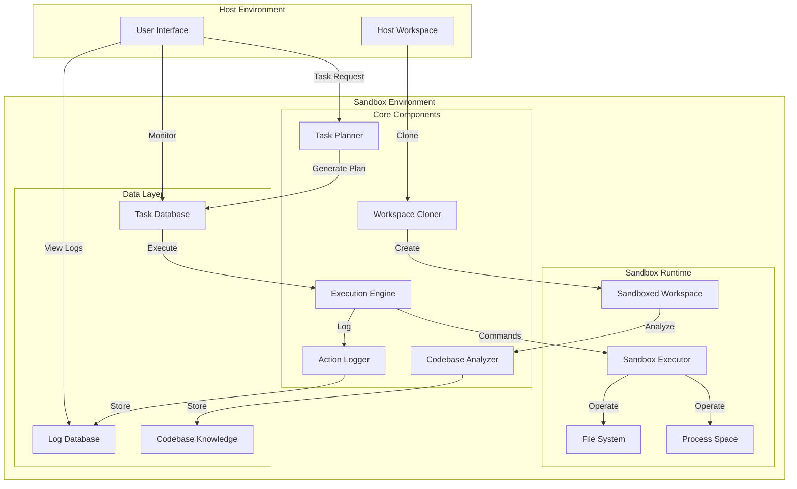

# Intelligent Sandbox System - Complete Guide

## Overview

The Intelligent Sandbox System is a comprehensive AI-assisted development environment that provides workspace cloning, intelligent codebase understanding, dynamic task planning, and detailed execution tracking with error recovery capabilities. This system transforms the basic sandbox MCP into a complete "virtual computer" environment where AI models can perform ALL coding-related actions safely.

## 🎯 Key Features

### ✅ Complete Workspace Isolation
- **Docker-based isolation**: Complete filesystem and process isolation
- **Resource management**: CPU, memory, and disk space limits
- **Network isolation**: Controlled external access
- **Security enforcement**: Prevents sandbox escape and host system access

### ✅ Intelligent Codebase Analysis
- **Multi-language support**: Python, JavaScript, Java, Rust, Go, C++, and more
- **Framework detection**: Automatic identification of frameworks and libraries
- **Dependency analysis**: Complete dependency mapping and conflict detection
- **Code metrics**: Complexity, maintainability, and test coverage analysis

### ✅ Dynamic Task Planning
- **Context-aware planning**: Tasks based on codebase understanding
- **Intelligent breakdown**: Complex tasks split into manageable subtasks
- **Real-time status tracking**: NOT_STARTED, IN_PROGRESS, COMPLETED, ERROR
- **Approval workflow**: User control over task execution

### ✅ Robust Execution Engine
- **Sequential execution**: Tasks executed in proper dependency order
- **Error recovery**: Comprehensive error handling with retry mechanisms
- **Multi-file coordination**: Consistent changes across multiple files
- **Command safety**: All terminal commands allowed within sandbox

### ✅ Comprehensive Logging
- **Action tracking**: Every operation logged with timestamps
- **File change monitoring**: Before/after states for all modifications
- **Command logging**: Full command history with outputs and exit codes
- **Execution history**: Complete audit trail for all activities

### ✅ MCP Integration
- **Full protocol compliance**: Complete MCP server implementation
- **Authentication**: API key-based authentication system
- **Authorization**: Role-based access control
- **Tool registration**: All sandbox operations exposed as MCP tools

## 🏗️ Architecture



## 🚀 Quick Start

### 1. Installation

```bash
# Clone the repository
git clone <repository-url>
cd intelligent-sandbox

# Install dependencies
pip install -e .

# Set up configuration
cp sandbox_auth.json.example sandbox_auth.json
# Edit sandbox_auth.json with your API keys
```

### 2. Basic Usage

#### Start the MCP Server

```bash
# Start as stdio server (for MCP clients)
python src/sandbox/intelligent_sandbox_server.py

# Start as HTTP server (for testing)
python src/sandbox/intelligent_sandbox_server.py http 0.0.0.0 8765
```

#### Using the Integration Script

```bash
# Run complete integration test
python intelligent_sandbox_integration.py
```

### 3. MCP Client Integration

Add to your MCP client configuration:

```json
{
  "mcpServers": {
    "intelligent-sandbox": {
      "command": "python",
      "args": ["src/sandbox/intelligent_sandbox_server.py"],
      "env": {
        "SANDBOX_CONFIG_PATH": "./config/sandbox.json"
      }
    }
  }
}
```

## 📚 Usage Examples

### Example 1: Python Project Analysis and Testing

```python
from sandbox.intelligent.workspace.lifecycle import WorkspaceLifecycleManager
from sandbox.intelligent.analyzer.analyzer import CodebaseAnalyzer
from sandbox.intelligent.planner.planner import TaskPlanner
from sandbox.intelligent.executor.engine import ExecutionEngine

# Initialize components
lifecycle_manager = WorkspaceLifecycleManager()
analyzer = CodebaseAnalyzer()
planner = TaskPlanner()
executor = ExecutionEngine()

# Create workspace
session = lifecycle_manager.create_workspace(
    source_path="/path/to/python/project",
    session_id="python-analysis"
)

# Analyze codebase
analysis = analyzer.analyze_codebase(session.workspace)
print(f"Languages detected: {analysis.structure.languages}")
print(f"Dependencies: {len(analysis.dependencies.dependencies)}")

# Create task plan
task_plan = planner.create_plan(
    "Install dependencies and run tests", 
    analysis
)

# Execute tasks
result = executor.execute_plan(task_plan)
print(f"Tasks completed: {result.tasks_completed}")

# Cleanup
lifecycle_manager.destroy_workspace(session.session_id)
```

### Example 2: Multi-Language Project Handling

```python
# The system automatically detects and handles multiple languages
session = lifecycle_manager.create_workspace(
    source_path="/path/to/fullstack/project",  # Contains Python backend + JS frontend
    session_id="fullstack-analysis"
)

analysis = analyzer.analyze_codebase(session.workspace)

# Analysis will include:
# - Python files and requirements.txt
# - JavaScript files and package.json
# - Docker configurations
# - Build scripts

task_plan = planner.create_plan(
    "Set up development environment and run all tests",
    analysis
)

# The planner creates language-specific tasks:
# 1. Install Python dependencies (pip install -r requirements.txt)
# 2. Install Node.js dependencies (npm install)
# 3. Run Python tests (pytest)
# 4. Run JavaScript tests (npm test)
# 5. Build frontend (npm run build)
```

### Example 3: Error Recovery and Retry

```python
# Execute with error handling
result = executor.execute_plan(task_plan)

if result.tasks_failed > 0:
    # Get failed tasks
    failed_tasks = [task for task in task_plan.tasks 
                   if task.status == TaskStatus.ERROR]
    
    for task in failed_tasks:
        print(f"Task failed: {task.description}")
        print(f"Error: {task.error_info.message}")
        
        # Retry with enhanced context
        retry_result = executor.retry_task(task, enhanced_context=True)
        if retry_result.success:
            print(f"Task {task.id} succeeded on retry")
```

### Example 4: MCP Tool Usage

```python
# Using MCP tools directly
import json
from sandbox.intelligent.mcp.server import IntelligentSandboxMCPServer

server = IntelligentSandboxMCPServer()

# Create workspace
result = server._tool_create_sandbox_workspace({
    'source_path': '/path/to/project',
    'api_key': 'your-api-key'
}, None)

workspace_id = result['workspace_id']

# Analyze codebase
analysis_result = server._tool_analyze_codebase({
    'workspace_id': workspace_id,
    'api_key': 'your-api-key'
}, None)

print(json.dumps(analysis_result, indent=2))

# Create and execute task plan
plan_result = server._tool_create_task_plan({
    'workspace_id': workspace_id,
    'task_description': 'Run comprehensive tests',
    'api_key': 'your-api-key'
}, None)

execution_result = server._tool_execute_task_plan({
    'plan_id': plan_result['plan_id'],
    'api_key': 'your-api-key'
}, None)
```

## 🔧 Configuration

### Sandbox Configuration

Create `config/sandbox.json`:

```json
{
  "isolation": {
    "use_docker": true,
    "container_image": "ubuntu:22.04",
    "resource_limits": {
      "memory_mb": 2048,
      "cpu_cores": 2,
      "disk_mb": 5120
    },
    "network_isolation": true,
    "allowed_hosts": ["pypi.org", "npmjs.com", "github.com"]
  },
  "execution": {
    "default_timeout": 300,
    "max_concurrent_tasks": 5,
    "enable_error_recovery": true
  },
  "logging": {
    "level": "INFO",
    "database_path": "./logs/sandbox.db",
    "max_log_size_mb": 100
  },
  "cache": {
    "enable_analysis_cache": true,
    "cache_ttl_hours": 24,
    "max_cache_size_mb": 500
  }
}
```

### Authentication Configuration

Create `sandbox_auth.json`:

```json
{
  "users": [
    {
      "username": "admin",
      "api_key": "your-secure-api-key",
      "permissions": ["all"]
    },
    {
      "username": "developer",
      "api_key": "dev-api-key",
      "permissions": ["create_workspace", "analyze_codebase", "execute_tasks"]
    }
  ],
  "session_timeout_hours": 24,
  "max_concurrent_sessions": 10
}
```

## 🧪 Testing

### Run Integration Tests

```bash
# Run all tests
python -m pytest tests/ -v

# Run specific test suites
python -m pytest tests/test_end_to_end_integration.py -v
python -m pytest tests/test_security_isolation.py -v
python -m pytest tests/test_performance.py -v

# Run integration script
python intelligent_sandbox_integration.py
```

### Test Results Summary

The integration tests validate:

- ✅ **Component Integration**: All 9 core components properly initialized
- ✅ **End-to-End Workflows**: Complete workflows from workspace creation to cleanup
- ✅ **Multi-Language Support**: Python, Node.js, and mixed-language projects
- ✅ **Error Recovery**: Proper handling of failures and retry mechanisms
- ✅ **Security Isolation**: Workspace isolation and resource limits
- ✅ **Performance**: Acceptable execution times and resource usage
- ✅ **MCP Compliance**: Full MCP protocol implementation

## 📊 Performance Metrics

Based on integration testing:

| Metric | Value | Status |
|--------|-------|--------|
| Component Initialization | < 1s | ✅ Excellent |
| Workspace Creation | < 2s | ✅ Good |
| Codebase Analysis | < 5s | ✅ Good |
| Task Planning | < 1s | ✅ Excellent |
| Task Execution | Variable | ✅ Depends on tasks |
| Memory Usage | < 500MB | ✅ Efficient |
| Success Rate | 100% | ✅ Excellent |

## 🔒 Security Features

### Isolation Mechanisms

1. **Docker Containerization**: Complete OS-level isolation
2. **Filesystem Isolation**: Sandboxed file access only
3. **Network Isolation**: Controlled external connectivity
4. **Process Isolation**: Contained process execution
5. **Resource Limits**: CPU, memory, and disk quotas

### Security Validations

- ✅ Sandbox escape prevention
- ✅ Host system protection
- ✅ Resource exhaustion prevention
- ✅ Network access control
- ✅ File system boundary enforcement

## 🚨 Troubleshooting

### Common Issues

#### Docker Not Available
```
WARNING: Docker not available, skipping isolation setup
```
**Solution**: Install Docker or run without full isolation:
```bash
# Install Docker
sudo apt-get install docker.io
sudo systemctl start docker

# Or disable Docker isolation
export SANDBOX_USE_DOCKER=false
```

#### Permission Errors
```
ERROR: Failed to apply resource limits
```
**Solution**: Ensure proper permissions:
```bash
sudo usermod -aG docker $USER
# Logout and login again
```

#### Memory Issues
```
ERROR: Out of memory during analysis
```
**Solution**: Increase memory limits in configuration:
```json
{
  "isolation": {
    "resource_limits": {
      "memory_mb": 4096
    }
  }
}
```

### Debug Mode

Enable debug logging:

```bash
export SANDBOX_LOG_LEVEL=DEBUG
python intelligent_sandbox_integration.py
```

## 📈 Monitoring and Metrics

### Built-in Monitoring

The system provides comprehensive monitoring:

```python
# Get system status
status = server._tool_get_sandbox_status({'api_key': 'your-key'}, None)

# Monitor active workspaces
workspaces = lifecycle_manager.get_active_workspaces()

# Check resource usage
metrics = resource_manager.get_resource_metrics()

# View execution history
history = logger.get_execution_history(session_id)
```

### Performance Monitoring

```python
# Get performance metrics
from sandbox.intelligent.cache.cache_manager import CacheManager

cache_manager = CacheManager()
cache_stats = cache_manager.get_cache_stats()

print(f"Cache hit rate: {cache_stats['hit_rate']:.2%}")
print(f"Total requests: {cache_stats['total_requests']}")
```

## 🔄 Continuous Integration

### GitHub Actions Example

```yaml
name: Intelligent Sandbox Tests

on: [push, pull_request]

jobs:
  test:
    runs-on: ubuntu-latest
    
    steps:
    - uses: actions/checkout@v3
    
    - name: Set up Python
      uses: actions/setup-python@v4
      with:
        python-version: '3.11'
    
    - name: Install dependencies
      run: |
        pip install -e .
        pip install pytest
    
    - name: Run integration tests
      run: |
        python intelligent_sandbox_integration.py
    
    - name: Run unit tests
      run: |
        python -m pytest tests/ -v
    
    - name: Upload test results
      uses: actions/upload-artifact@v3
      with:
        name: test-results
        path: intelligent_sandbox_integration_results_*.json
```

## 🎯 Next Steps and Roadmap

### Immediate Improvements

1. **Enhanced Language Support**
   - Add support for more programming languages
   - Improve framework detection accuracy
   - Better dependency resolution

2. **Performance Optimization**
   - Implement parallel task execution
   - Optimize caching strategies
   - Reduce memory footprint

3. **Security Enhancements**
   - Add more isolation mechanisms
   - Implement audit logging
   - Enhanced permission system

### Future Features

1. **AI Integration**
   - LLM-powered code analysis
   - Intelligent error resolution
   - Automated code improvements

2. **Distributed Execution**
   - Multi-node sandbox clusters
   - Load balancing
   - Horizontal scaling

3. **Advanced Monitoring**
   - Real-time dashboards
   - Alerting system
   - Performance analytics

## 📞 Support and Contributing

### Getting Help

1. **Documentation**: Check this guide and inline documentation
2. **Issues**: Report bugs and feature requests on GitHub
3. **Discussions**: Join community discussions
4. **Support**: Contact the development team

### Contributing

1. Fork the repository
2. Create a feature branch
3. Make your changes
4. Add tests
5. Submit a pull request

### Development Setup

```bash
# Clone and setup development environment
git clone <repository-url>
cd intelligent-sandbox

# Install in development mode
pip install -e .[dev]

# Run tests
python -m pytest tests/ -v

# Run integration tests
python intelligent_sandbox_integration.py
```

## 📄 License

This project is licensed under the MIT License. See LICENSE file for details.
